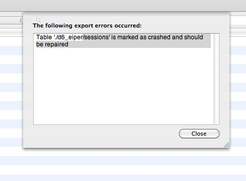

**Problem:**  Unable to log into a Drupal site.  Logging in with valid credentials would fail without any visible error in the UI.

**Solution:** Repair the sessions table.

When I exported the database using Sequel Pro, I got the following error: "Table './d6\_eiper/sessions' is marked as crashed and should be repaired'.  I was able to do this with Sequel Pro, but you could also use phpMyAdmin.

Update 4/6/2012: More tables starting crashing in the same way and we were able to repair them as well.  The reason for these crashes is still a mystery.  We restarted the web server and haven't seen any crashes since.
