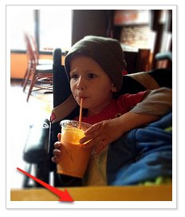

**Problem:** Space appears just below an image.  This becomes obvious whenever you add a border.

**Solution:** Set the image's display to block.  The default display of an image is inline, which includes line-height.

http://jsfiddle.net/FMqjf/4/
