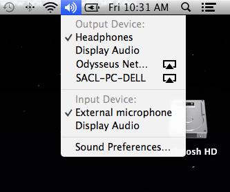

Since updating to Mavericks I noticed that my audio was coming out of my laptop rather than then my external monitor. To correct this, I learned that if you press and hold the "option" key while selecting the sound icon in the menu bar you will get other audio options.

This also allows you to send audio to any AirPlay-enabled device AFTER you've started playing the audio. Sweet.
