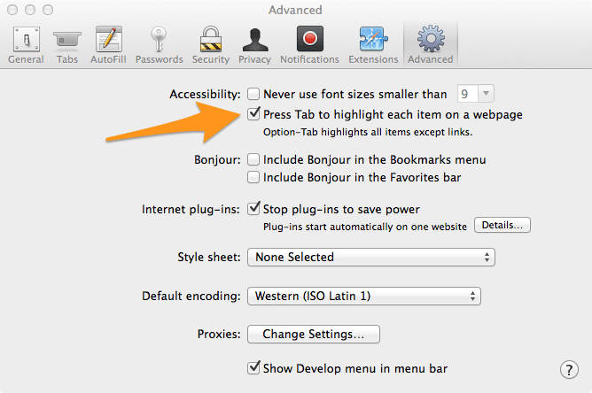
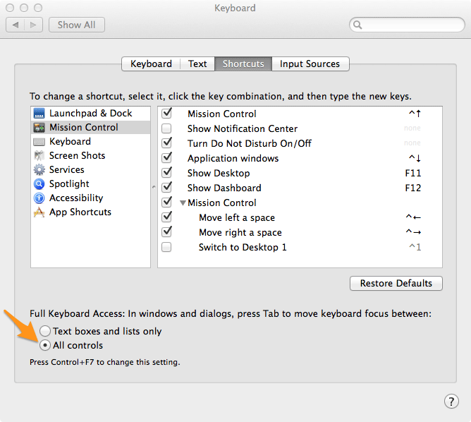

According the WCAG 2.1 guideline, we should ensure that our websites are "keyboard accessible", which I take to mean that you can tab through each of the links on the page and get visual feedback as to which link you are currently focused on.

When testing my site, I noticed that keyboard navigation worked fine in Chrome, but not in Safari or Firefox.  A little searching around turned up that both of these browsers require a preferences adjustment to turn on keyboard navigation.

## Safari

Go to Preferences/Advanced and under Accessibility check "Press Tab to highlight each item on a webpage".

## Firefox

Firefox looks to OSX system preferences for this setting.  Go to System Preferences/Keyboard/Shortcuts and select "All controls" at the bottom of the screen under "Full Keyboard Access".

With these settings you should be able to load up your favorite website and start tabbing through the links on the page.  Check out the Stanford homepage for a good example.

## Related Resources

- Enabling keyboard navigation in Mac OS X Web browsers | 456 Berea Street
- Keyboard Access | Stanford Online Accessibility Program
