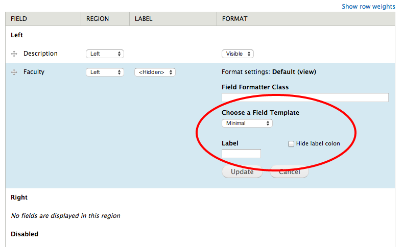

By default, Drupal appends a colon to the end of field labels.  If you would like to remove them and you are already using Display Suite to layout your content types, Display Suite Extras is a great option.

My Google searches resulted in countless recommendations to create a custom copy of the field.tpl.php template.  Editing templates is fine, but for this use case that seems a  bit heavy-handed.

Here are the steps:

- Enable Display Suite Extras
- Select  the "Enable Field Templates" checkbox at admin/structure/ds/list/extras
    
    \[caption id="attachment\_1195" align="alignnone" width="300"\] Configuration page for Display Suite Extras\[/caption\]
- On the same page set the "Default Field Template" to either "Minimal" or "Expert"
- Now when you configure your field under "Manage Display" for the content type, you will see a "Hide label colon" option.
    
    \[caption id="attachment\_1196" align="alignnone" width="300"\] Display Suite Extras field configuration page\[/caption\]
- Using the "Expert" template will provide even more options.
