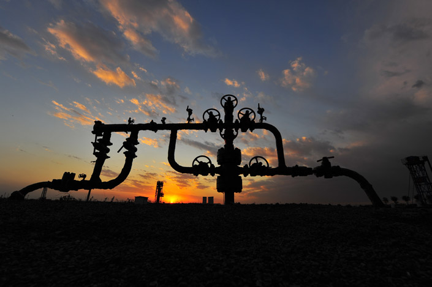

The bulk of methane emissions in the United States can be traced to a small number of “super emitting” natural gas wells, according to a new study.

Source: ‘Super emitters’ responsible for most U.S. methane emissions | Stanford News
