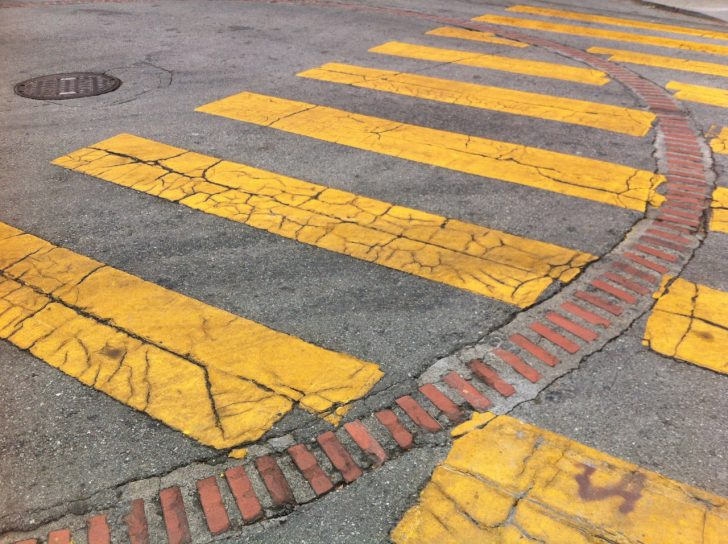

> Standing out against the linear grid of city streets and pedestrian crossing stripes, over 170 strange brick circles can be found embedded in the pavement throughout San Francisco. At their center: a metal circle that looks a lot like a manhole cover for sewer access. In fact, these brick outlines are a surface expression of something

Source: _Decoding Rings: Beneath the Mysterious Brick Circles on San Francisco Streets - 99% Invisible_
