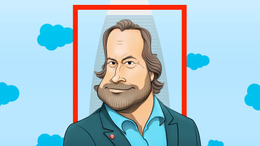

  
  
In early July 2018, Marc Benioff packed his iPhone and iPad into a FedEx envelope and mailed it to his summer home in Hawaii. The billionaire CEO of Salesforce then hopped on a plane out of San Francisco for a quiet two-week vacation across the Galapagos Islands, Bora Bora and Easter Island.  
  
from https://cnb.cx/2F8bmhL
