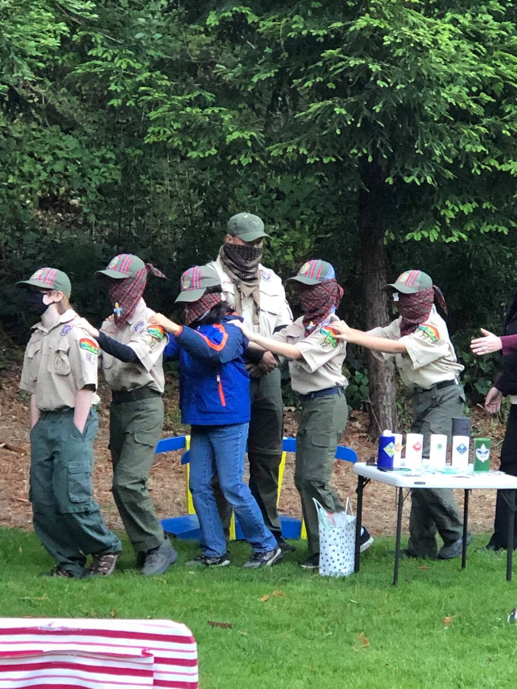
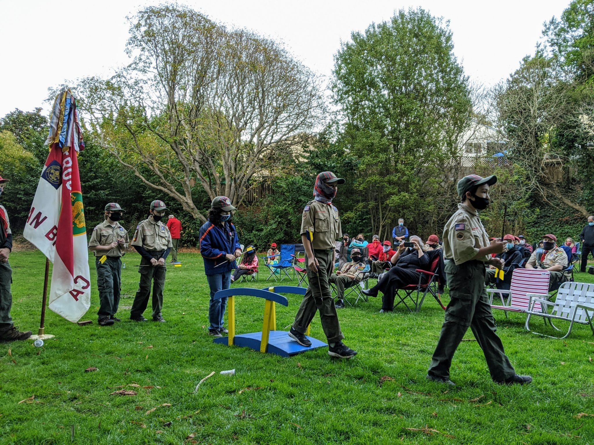
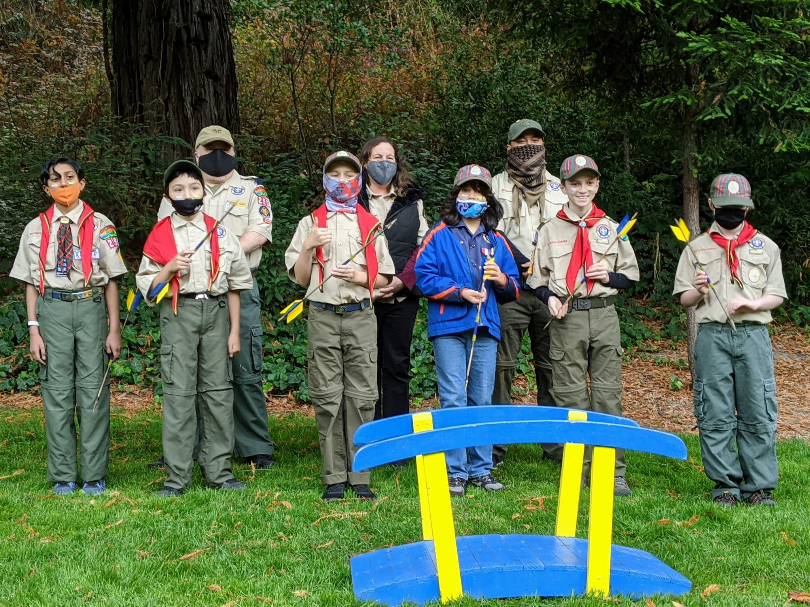
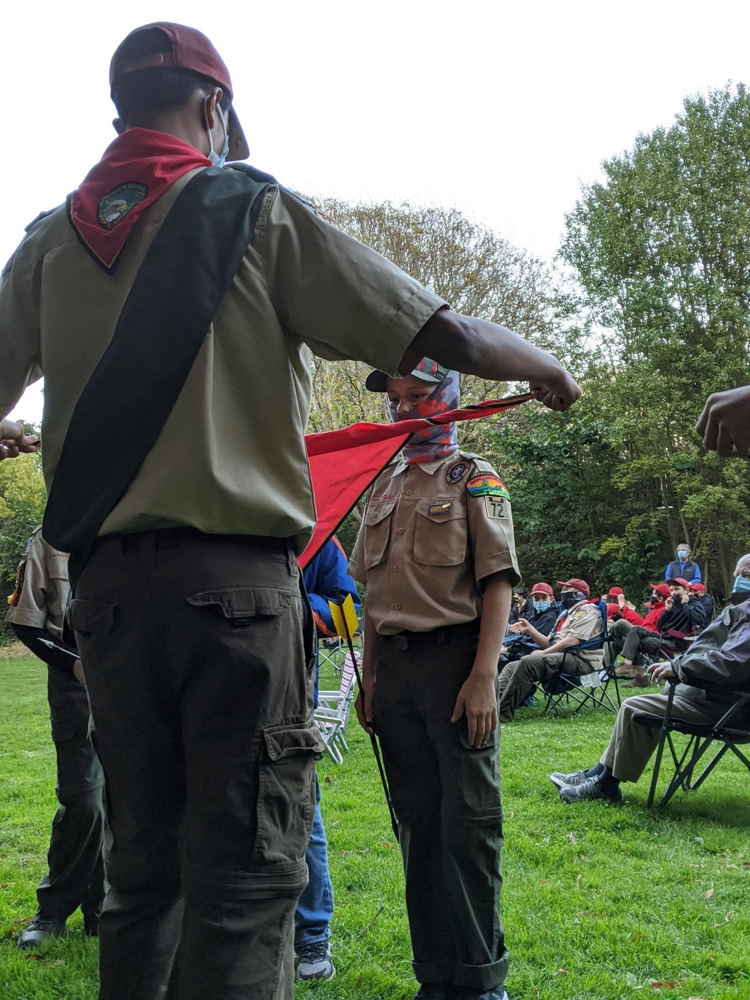
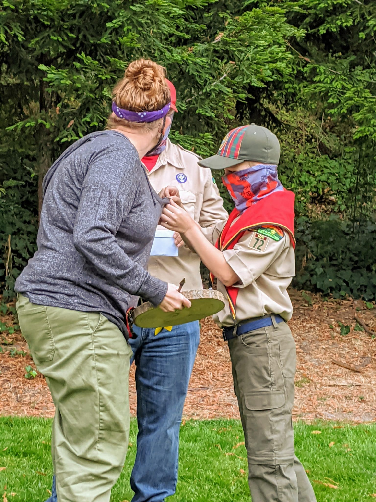
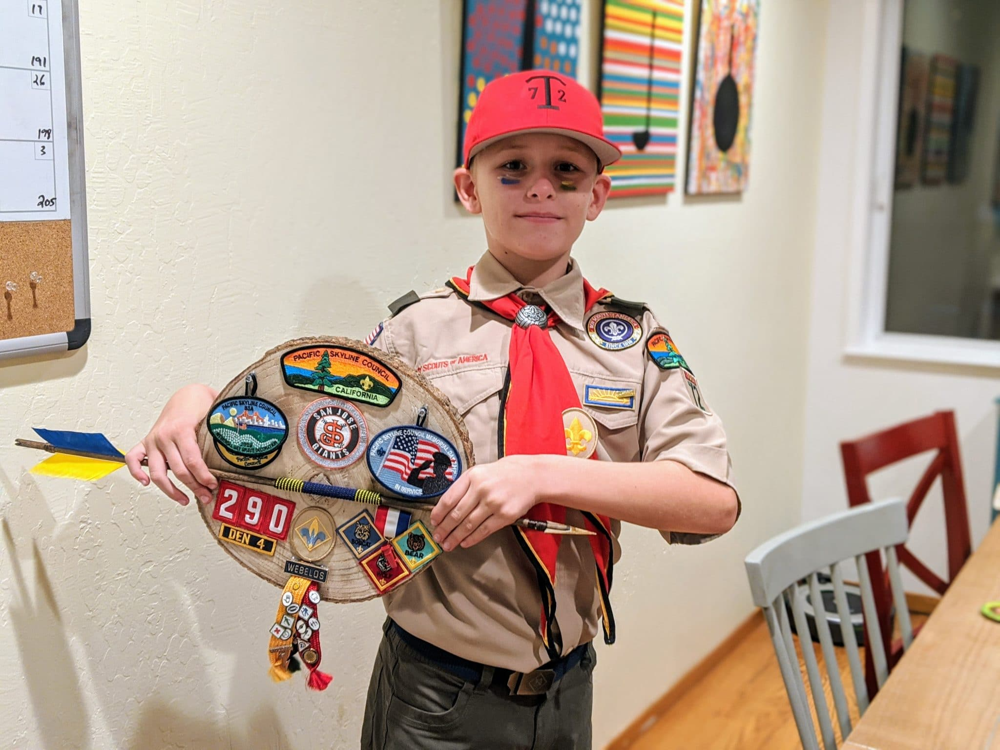

Tonight, Dylan's Scout troop held the bridging ceremony the Cub Scouts would normally have done last spring if not for a global pandemic. As it was, he bridged and earned his Scout rank at the same time.

<figure>

- <figure>
    
    
    
    <figcaption>
    
    Den 4 leading each other to the Bridging Ceremony.
    
    </figcaption>
    
    </figure>
    
- <figure>
    
    
    
    <figcaption>
    
    Den 4 bridging to BSA
    
    </figcaption>
    
    </figure>
    
- <figure>
    
    
    
    <figcaption>
    
    Holding their new arrows
    
    </figcaption>
    
    </figure>
    
- <figure>
    
    
    
    <figcaption>
    
    D earning his BSA scarf.
    
    </figcaption>
    
    </figure>
    
- <figure>
    
    
    
    <figcaption>
    
    Dylan pinning Mom with her parent Scout pin.
    
    </figcaption>
    
    </figure>
    
- <figure>
    
    
    
    <figcaption>
    
    Dylan hold up his new plaque with all of his Cub Scout pins and patches.
    
    </figcaption>
    
    </figure>
    

</figure>
