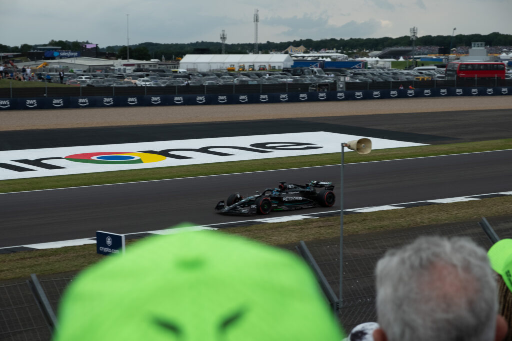

The first stop in our epic Europe 2023 family trip.

## Highlights

- The Orbit in Queen Elizabeth Olympic Park

- Walks down Brick Lane to get to the Underground

- Sky Garden for a free view of the city

- Leadenhall Market

- Walked by the Tower of London

- Thames River cruise

- Pass by Parliament/Big Ben ala American Vacation

- A failed attempt to find 10 Downing Street

- Walked _near_ Buckingham Palace (we were tired and hangry)

- Unplanned visit to the Fortnum & Mason (est 1707) store. All sorts of cool food products

- Walk around St Paul’s (no tickets to get inside)

- Walk across the Millenial Bridge

- Visit the Tate Modern. Boys weren’t sure what to think of the art. Success!

- Borough Market for lunch

- Miniature golf in a WWII-looking bunker

- Mini-date at The Carpenters Arm for Mom and Dad

- Qualifying at the F1 British Grand Prix at Silverstone

- Dylan tried an English Breakfast (potatoes were a hit, blood sausage not so much).

- Foyle’s bookstore

- Midday break in Victoria Embankment Gardens

- We Will Rock You musical

- Covent Garden Market

- Eurostar high-speed rail

## Shoreditch

## The Orbit at Queen Elizabeth Olympic Park

## Sky Garden to Piccadilly Street

## British Grand Prix at Silverstone

## Foyle’s bookstore

