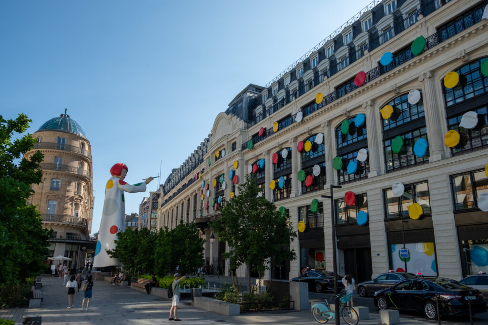
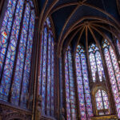
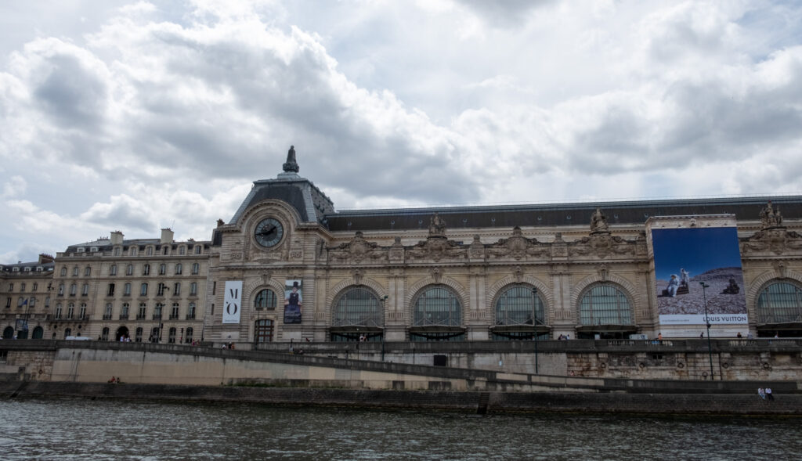
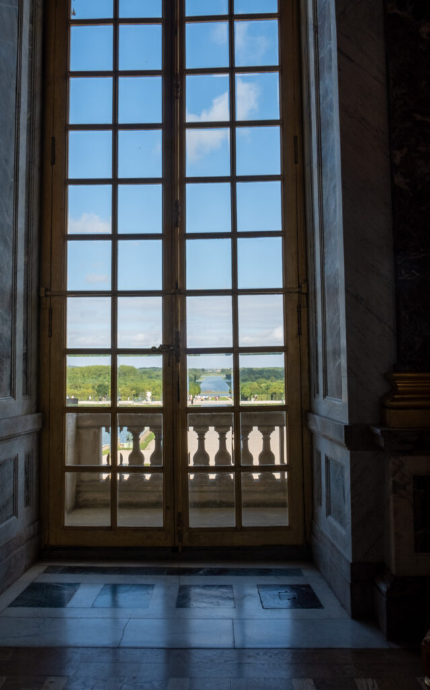
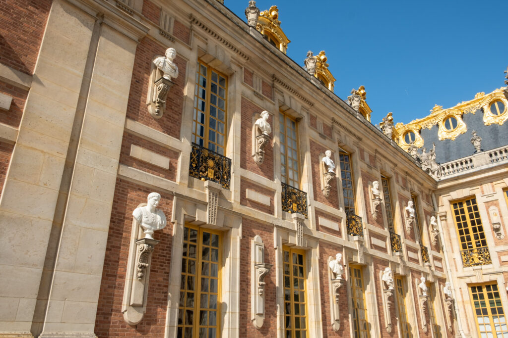

Our 2nd stop in Europe. Definitely more hectic than London, but we had a great time. The boys had some culture force-fed and Mom and Dad got to check off some memories.

## Highlights

- Great little apartment a block from the Louvre. 94 steps each time, but a wonderful balcony on the top floor and the cool (actually a bit hot) attic room for the boys.

- Dinner at Le Bistrot Des Halles. Foie Gras Pate and Steak Poivie

- Conciergerie. Part of the old palace where Marie Antoinette was imprisoned. Also the history of French cuisine exhibit. 

- Sainte-Chapelle Church

- Military practice fly-over in preparation for Bastille Day. Wow.

- Food tour with Ally. Pate a choux, escargot (everyone except Elliot), macarons, fresh fruit, cheese plate, and chocolate. 

- Eiffel Tower. The bus was detoured and took us WAY out of the way. Rode through the Arc De Triumph. CRAZY.  We met a lovely woman on the bus who works as a tour guide and guided us from where we got dropped off to the tour pickup. Waited in line for three hours. 1665 steps to the top. (We took the elevator). Mom and Dylan called it on the 2nd level. Elliot and Dad went to the top. 

- Seine River cruise

- Late lunch at Cafe Flore. The boys were not thrilled with French food. D tried though.

- Drinks at L’Express Bar next to the apartment for Mom and Dad.

- Dinner with the boys next door at Enza Famiglia Trattoria e Pizzeria.

- Train out to Versailles. Rode bikes to Chateau de Versailles. Walked through the “chateau” and nearby gardens. Back on the bikes for a ride around the ginormous canal.

- Dinner date for Mom and Dad at Postiche

- Christian Dior Gallerie

- Mom's appointments at Christian Dior and Louis Vuitton. Dad and the boys took a walk and saw the Arc De Triumph again.

- Meant to check out the grounds in front of the Louvre, but they were closed for Bastille Day. Dad and the boys rode the giant ferris wheel nearby.

- Grabbed some slushies (it was hot) and sat by the Seine to watch the sunset.

## Our apartment and the surrounding neighborhood

## Conciergerie, Sainte-Chapelle, and Notre Dame

## Food Tour

## Eiffel Tower

## Seine River Cruise

## Versallies

