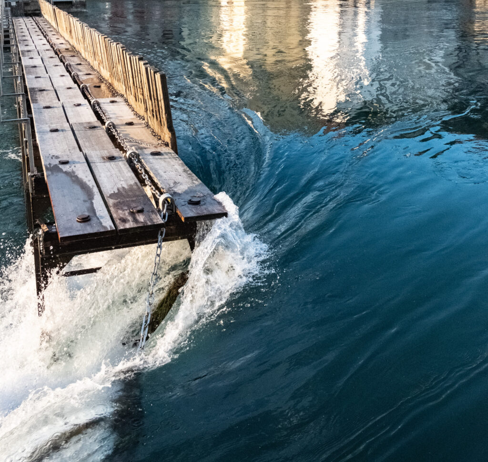
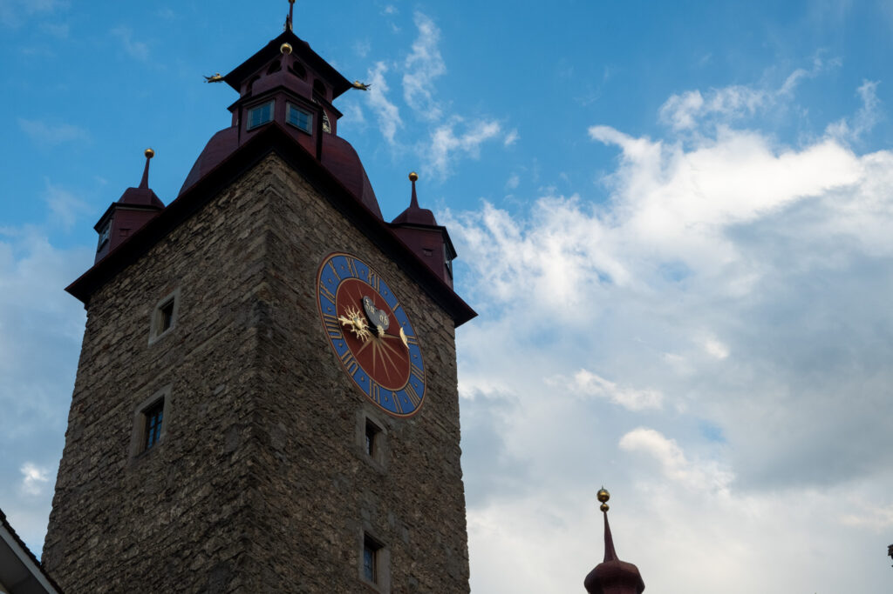
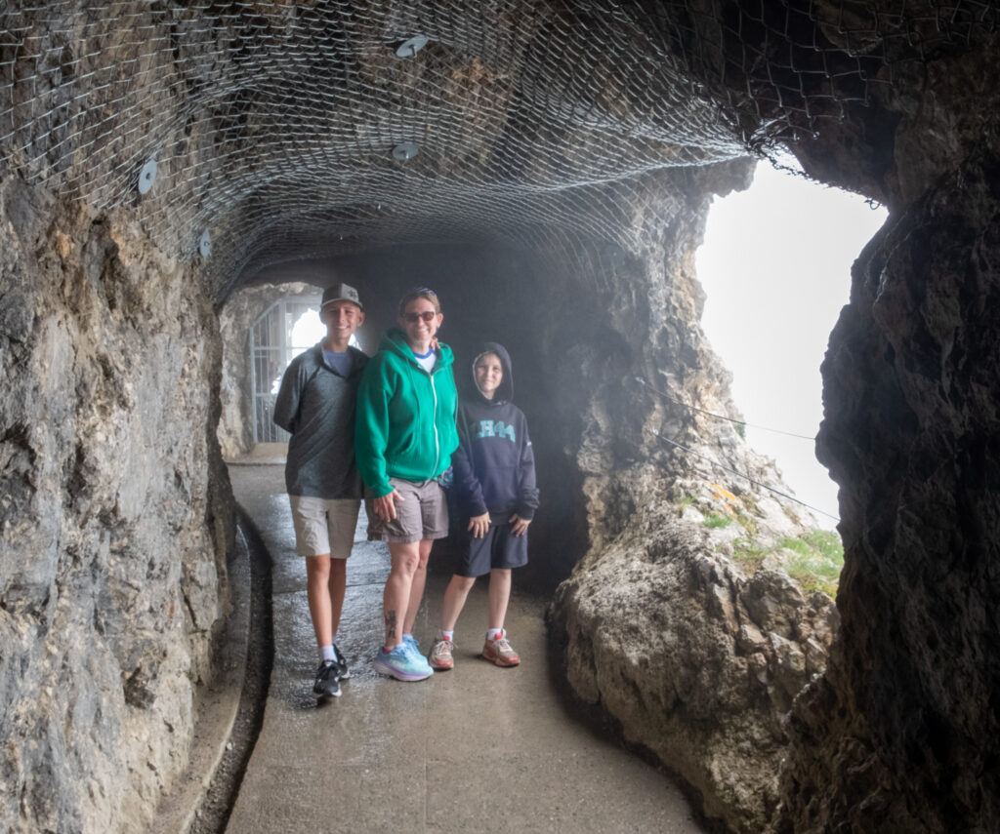
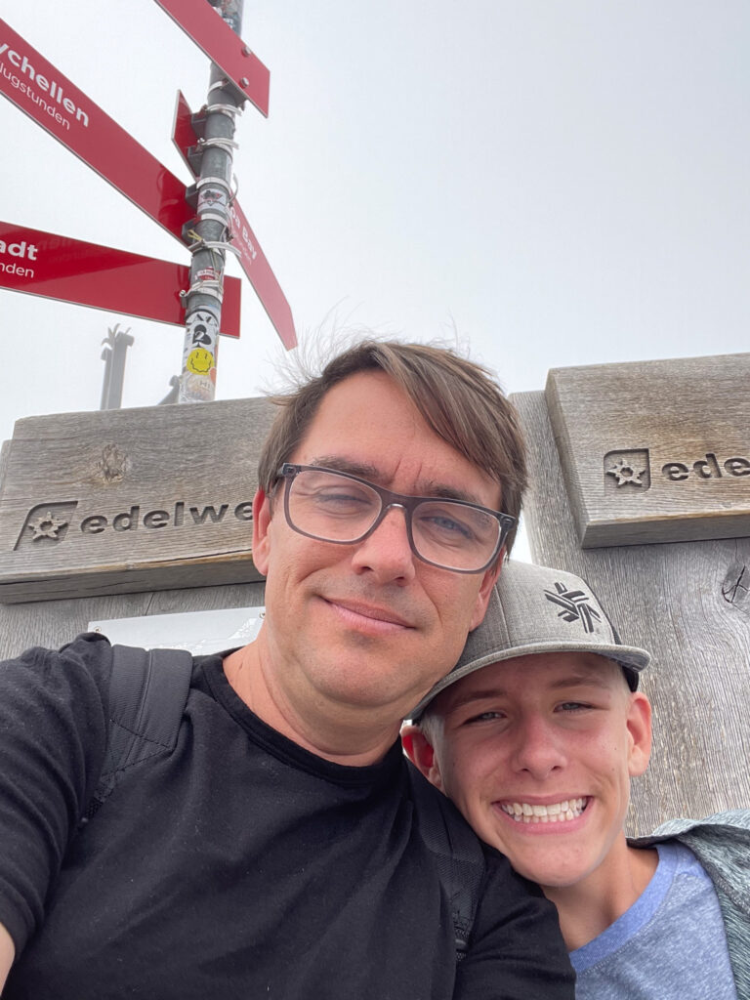
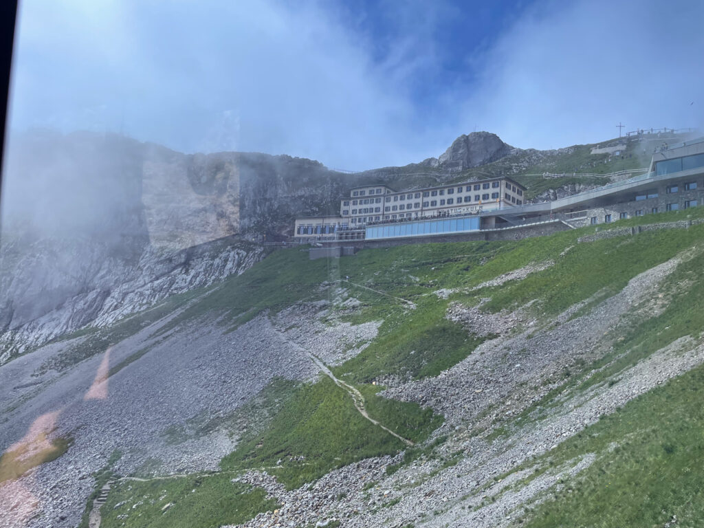

Our 3rd stop on the great European vacation and our first hotel stay.

## Highlights

- The high-speed train from Paris to Basel was even nicer than the Eurostar from London to Paris.  Accidentally got on the wrong train from Basel to Lucern, but we were able to recover at the next stop.  There are way more trains in Europe!

- Checked in at the quaint Beau Sejour.  Our room looked out onto Lake Lucern (and had A/C).

- Walked across Chapel Bridge

- Dinner at Wirtshaus Taube. So much fried cheesy goodness. The boys were relieved after Paris. 

- Paddle boat on lake lucern. The captains were arguing about which direction to go. Entertainment consisted of dad jokes and 360s. No yachts were destroyed. 

- Mt. Pilatus. 10-minute bus ride from Lucern. 20-minute four-person gondola up. Ten-minute Dragon 50-person gondola to the top. 

- Hiking and snacks at the visitor center. The Dragon Path hike around the summit was terrifying. Visibility was almost nothing (Still scary). 

- 30-minute funicular train ride all the way down. 

- One-hour boat ride home on the lake. 

- Dinner at Disco Pizza which was surprisingly good. 

- Successfully mailed our extra stuff home

- Swimming in Lake Lucern at Parkanlage Ufschhötti

- Dinner at Bierlibe next to Chapel Bridge

