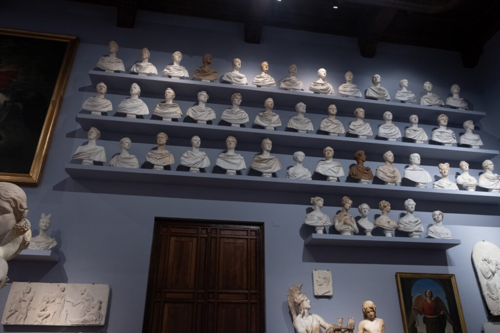

Our fifth and final stop in Europe. Super hot and busy, but we were able to have many wonderful experiences.

## Highlights

- Dawn found a great rental apartment just off Palazzo Vecchio. Plenty of space and A/C, which allowed us to take much-needed breaks from the heat and crowds.

- Loaded up on carbs at a Trattoria Anita around the corner from our apartment on the first night.

- Waked the halls of the Pitti Palace. In addition to the expected period artwork, they have a costume and fashion exhibit that surprised us.

- Found a wine window.

- "Gelato 30" was the promise of gelato every 3-4 hours.

- Pasta-making class. Brown butter and sage from now on.

- Leonardo Da Vinci Interactive Museum with Dad and Elliot.

- Perfume-making class with Dawn and Dylan.

- Chocolate tasting at Slitti

- Our nicest meal at Buca Mario. Dawn and Dylan shared a huge Florentine steak. All of our steaks in Europe were cooked extremely rare.

- Made it through the crowds to see The David at Accademia Gallery and were glad we did.

<figure>

<figure>

<figcaption>

Arriving on the Freccia Rossa

</figcaption>

</figure>

<figure>

<figcaption>

Our home for the week.

</figcaption>

</figure>

</figure>

## Walking Around Florence

## Pitti Palace

## Pasta-making class

## Around the Duomo

We never got into the Duomo, but it was on the way to everything else we did.

## Gelato

We promised the boys a lot of gelato. The term "Gelato 30" was coined.

## Gallery of the Academy

Our tickets to see David were for our last full day in Florence.

## Last Night

Our last date night was pretty simple. Grab two glasses, a bottle of wine, and head to the Ponte alla Grazie bridge, and watch the sunset.

